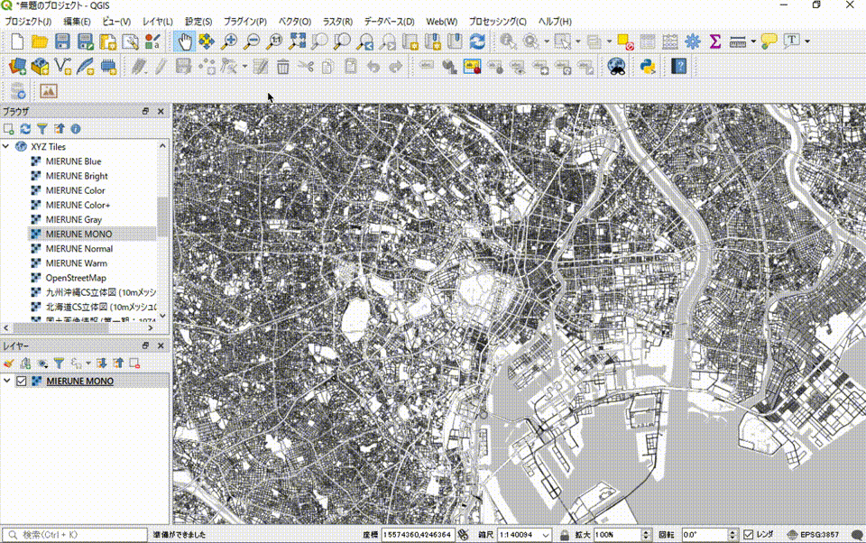
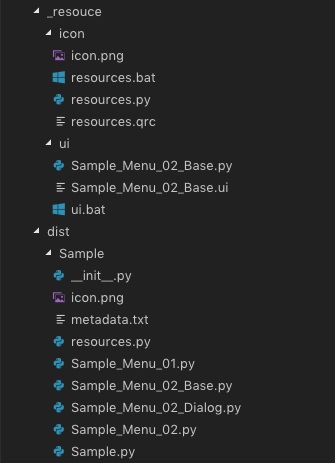
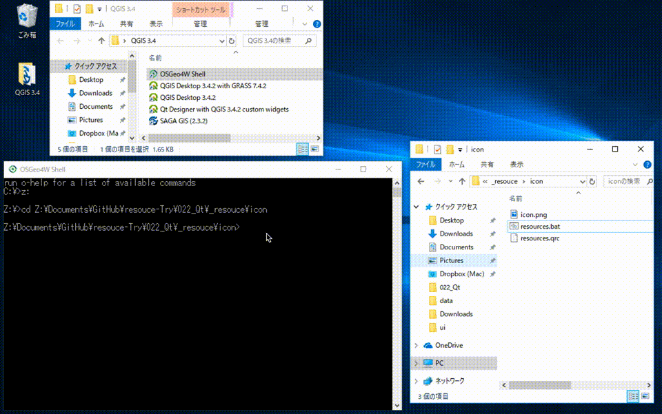
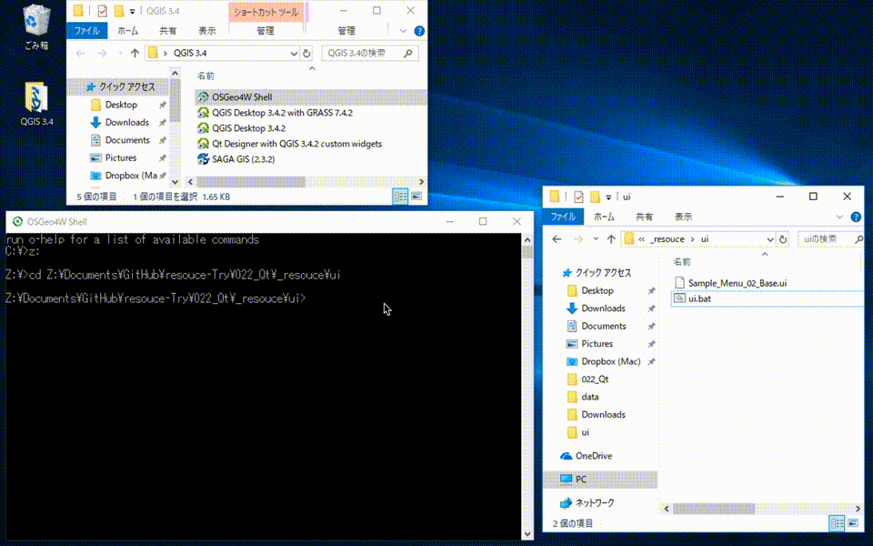

# qgis3plugin-starter

 

Start QGIS3 Plugin easily.  

 

## Usage

 

./_resouce/ui/ui.bat

 

./_resouce/icon/resources.bat

 

./dist/Sample

 

## License
Python modules are released under the GNU General Public License v2.0

Copyright (c) 2018 Yasunori Kirimoto

 

---

 

### Japanese

 

# QGIS3プラグイン スターター

 

QGIS3プラグイン構築を手軽に始める  

 

## Usage

 

./_resouce/ui/ui.bat

 

./_resouce/icon/resources.bat

 

./dist/Sample

 

## ライセンス
Python modules are released under the GNU General Public License v2.0

Copyright (c) 2018 Yasunori Kirimoto

 
