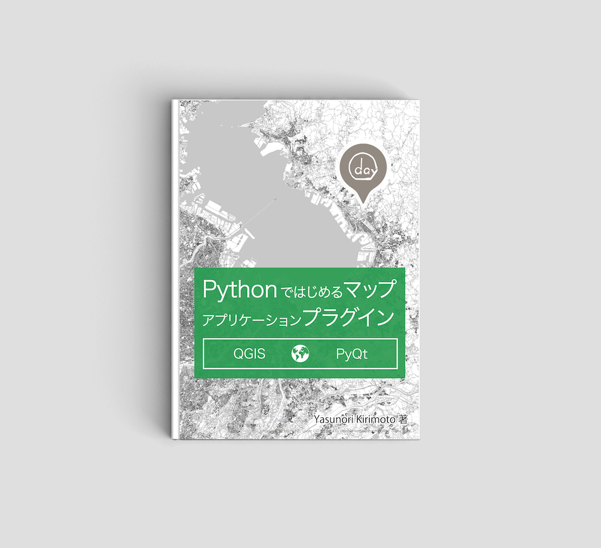
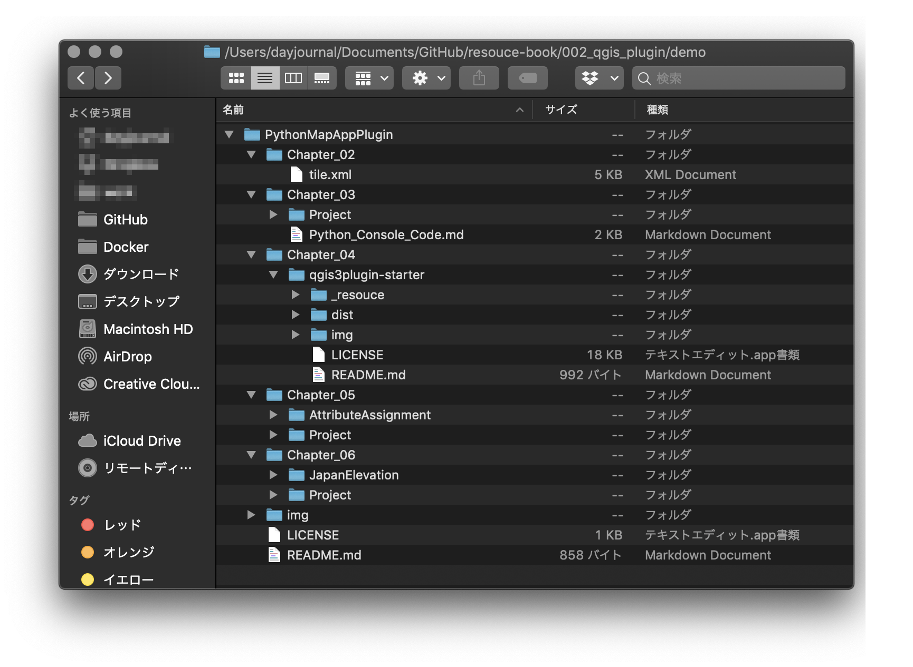

# Pythonではじめるマップアプリケーションプラグイン

 

技術書典7で販売する書籍のサンプルデータ用のリポジトリです。  

[詳細情報](https://techbookfest.org/event/tbf07/circle/5748496426598400)

 

## サンプル一覧
書籍で紹介しているサンプルデータ一式を格納  

利用データ  
- OpenStreetMap  

 

## ライセンス
MIT  

Copyright (c) 2019 Yasunori Kirimoto  

 
